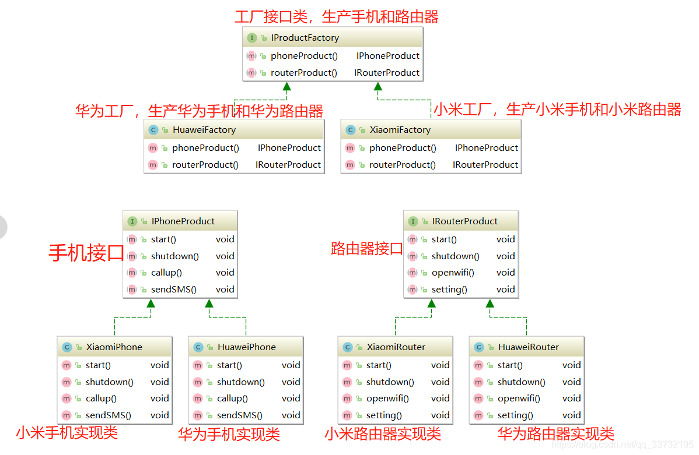

# JavaPattern

### 1.工厂模式（Factory Pattern）

#### 1.1.简单工厂模式（Simple Factory Pattern）
简单工厂模式不是一个正式的设计模式，但它是工厂模式的基础。它使用一个单独的工厂类来创建不同的对象，根据传入的参数决定创建哪种类型的对象。

#### 1.2.多个工厂方法模式（method factory pattern）
是对普通工厂模式的改进，在普通工厂方法模式中，如果传递的字符串出错，则不能正确创建对象，而多个工厂方法模式是提供多个工厂方法，分别创建对象。

#### 1.3.静态工厂方法模式（static method factory pattern）
将多个工厂方法模式里的方法置为静态的，不需要创建实例，直接调用即可

### 2.抽象工厂模式

工厂方法模式存在一个严重的问题： 一个具体工厂只能创建一类产品
而在实际过程中，一个工厂往往需要生产多类产品。为了解决上述的问题，我们又使用了一种新的设计模式：抽象工厂模式

提供一个创建一系列相关或相互依赖对象的接口，而无须指定它们具体的类；具体的工厂负责实现具体的产品实例。

示例：有手机和路由器两种产品，有华为和小米两种品牌，两种品牌都可以生产手机和路由器

  （1）有手机和路由器两种产品，定义两个接口；

  （2）小米和华为都可以生产这两种产品，所以有4个实现类；

  （3）现在需要创建华为和小米的工厂类，先将工厂类进行抽象，里面有创建两个产品的方法，返回的是产品的接口类；

  （4）创建华为和小米的工厂实现类，继承工厂类接口，实现创建各自产品的方法；

  （5）客户端调用时，直接用工厂接口类创建需要的工厂，拿到对应的产品；

如果产品族中新增一个产品笔记本电脑，也就是说华为和小米现在可以生产电脑了，如下图所示，对顶层的工厂接口类也要修改，这是非常麻烦的；

如果新增一个品牌苹果，也生产手机和路由器，符合OCP原则，如下图所示

#### 优点

(1)降低耦合
抽象工厂模式将具体产品的创建延迟到具体工厂的子类中，这样将对象的创建封装起来，可以减少客户端与具体产品类之间的依赖，从而使系统耦合度低，这样更有利于后期的维护和扩展；

(2)更符合开-闭原则
新增一种产品类时，只需要增加相应的具体产品类和相应的工厂子类即可
简单工厂模式需要修改工厂类的判断逻辑

(3)符合单一职责原则
每个具体工厂类只负责创建对应的产品
简单工厂中的工厂类存在复杂的switch逻辑判断

(4)不使用静态工厂方法，可以形成基于继承的等级结构。
简单工厂模式的工厂类使用静态工厂方法

#### 缺点

抽象工厂模式很难支持新种类产品的变化。
这是因为抽象工厂接口中已经确定了可以被创建的产品集合，如果需要添加新产品，此时就必须去修改抽象工厂的接口，这样就涉及到抽象工厂类的以及所有子类的改变，这样也就违背了“开发——封闭”原则。
对于新的产品族符合开-闭原则；对于新的产品种类不符合开-闭原则，这一特性称为开-闭原则的倾斜性。

